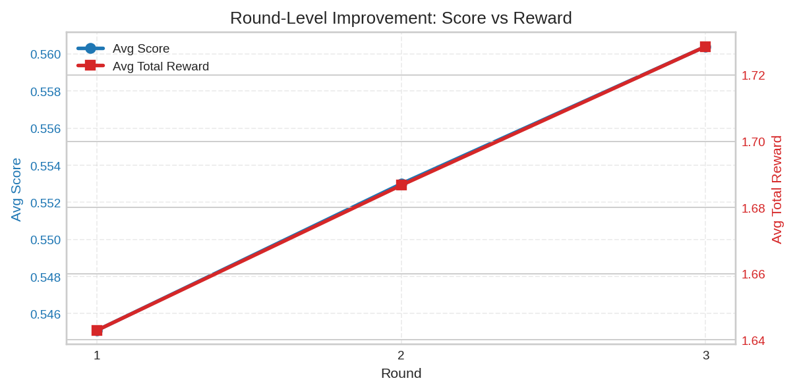
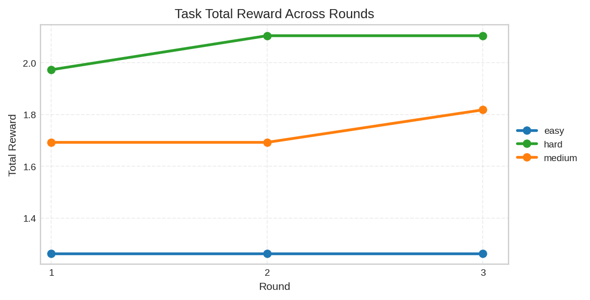
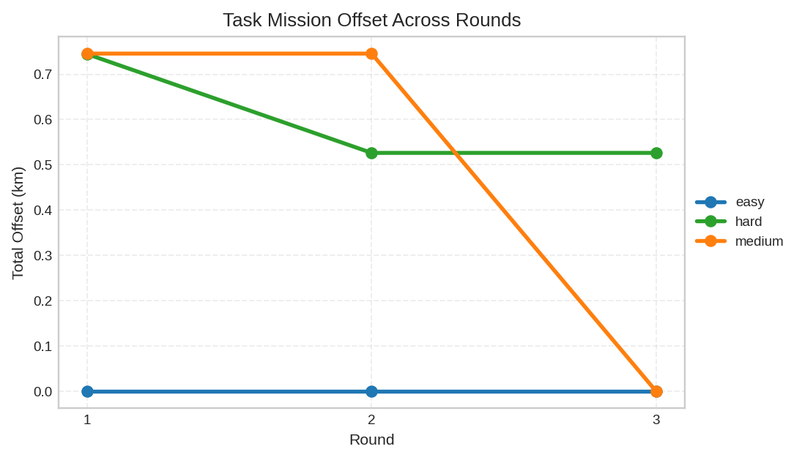

# Dataset-Informed Iterative Inference for Space Debris Collision Avoidance in an OpenEnv Benchmark

## Abstract

This report presents a practical, reproducible approach for collision-avoidance decision support in the Orbits OpenEnv benchmark. The environment models short-horizon conjunction management as a sequential control problem with resource constraints (fuel, tracking budget, and mission-offset limits). We implement an iterative inference pipeline that combines (1) a strict action contract for large language models (LLMs), (2) dataset-informed task priors derived from SATCAT/UCS/Kelvins EDA outputs, and (3) cross-round memory that feeds prior outcomes back into later rounds. The approach is not policy-gradient reinforcement learning; rather, it is reward-informed iterative prompting with structured simulator feedback. We document system design, simulator mechanics, evaluation metrics, model-switching robustness improvements, and observed behavior under multiple model endpoints. Results show measurable improvement in average score and average reward across rounds in representative runs, while binary success can remain zero due to strict terminal thresholds. We conclude with limitations and concrete extensions toward true RL and richer physics.

## 1. Introduction

Space-object conjunction management requires balancing safety and mission continuity under uncertainty. In practice, operators trade off collision-risk reduction against maneuver cost, mission deviation, and limited tracking resources. This project implements that trade-off in a controlled benchmark environment and exposes a standardized API and inference entrypoint.

The main objective is to produce reliable autonomous action selection across three difficulty tiers (easy/medium/hard), while preserving reproducibility and operational robustness. The work emphasizes:

- Environment transparency and deterministic benchmarking.
- Data-informed task calibration from external catalogs.
- Practical iterative improvement without retraining a policy network.

## 2. Problem Formulation

Each episode consists of discrete decision steps over a finite horizon. At each step, the agent receives an observation and outputs one action:

- `noop`
- `request_tracking_update`
- `radial_maneuver`
- `along_track_maneuver`
- `normal_maneuver`

with magnitude in $[0,1]$.

The simulator tracks conjunction events with:

- collision probability,
- predicted miss distance,
- time to closest approach,
- uncertainty,
- axis-specific maneuver effectiveness.

The objective is to minimize residual risk while preserving fuel and mission geometry constraints.

## 3. System Overview

### 3.1 Runtime Components

- Simulator core: `src/orbits_env/simulator.py`
- Typed models: `src/orbits_env/models.py`
- Task catalog and priors merge: `src/orbits_env/tasks/catalog.py`
- Grading: `src/orbits_env/graders/scoring.py`
- LLM inference loop: `inference.py`
- Iterative loop: `scripts/run_iterative_inference.py`
- Priors builder: `scripts/build_task_priors.py`

### 3.2 Environment Difficulty Tiers

Baseline task settings (before priors override):

| Parameter | Easy | Medium | Hard |
|---|---:|---:|---:|
| Horizon | 6 | 8 | 10 |
| Initial fuel | 9.5 | 8.0 | 7.2 |
| Initial tracking quality | 0.82 | 0.68 | 0.57 |
| Tracking budget | 2 | 2 | 3 |
| Success probability threshold | 0.18 | 0.24 | 0.28 |
| Max total offset (km) | 2.4 | 2.1 | 1.9 |
| Number of conjunctions | 1 | 2 | 3 |

Difficulty increases by reducing certainty/resources and increasing multi-threat planning pressure.

## 4. Simulator Mechanics (Physics Proxy)

This benchmark uses a structured proxy model rather than high-fidelity orbital propagation. It does **not** maintain explicit Cartesian position/velocity states. Instead, it evolves risk-centric state variables.

### 4.1 Step Dynamics

At each step:

1. Apply chosen action and resource costs.
2. Update conjunction attributes via action effectiveness and timing factors.
3. Apply passive dynamics:
- tracking-quality decay,
- uncertainty drift,
- probability growth pressure,
- miss-distance erosion,
- countdown of time-to-closest-approach.
4. Increment step index and check termination.

### 4.2 Horizon and Termination

Episode termination occurs if any of the following is true:

- fuel exhausted,
- mission deviation exceeds limit,
- imminent collision threshold crossed at closest approach,
- all conjunctions resolved, or horizon reached.

`horizon_remaining` is computed from `horizon - step_index` and clipped at zero.

### 4.3 Success Boolean

`success=True` only when, at episode end:

1. highest residual collision probability is below task threshold, and
2. total mission offset is within allowed bound.

This strict gate explains why score can improve while success remains zero.

## 5. LLM Interface and Robustness

### 5.1 Prompt Contract

The model receives:

- current observation payload,
- strategy notes,
- recent in-episode history (with per-step rewards),
- optional cross-round memory.

It must return strict JSON:

```json
{"action_type": "radial_maneuver", "magnitude": 0.52}
```

### 5.2 Output Validation and Recovery

To support heterogeneous providers/models:

- JSON mode is attempted first when available.
- If provider-side JSON mode fails, plain completion is retried.
- Parser extracts JSON from mixed text when needed.
- Additional guardrails map common malformed outputs to safe parsing retries.

### 5.3 Provider-Switching Improvements

Recent hardening includes:

- multi-key env resolution (`HF_TOKEN`, `OPENAI_API_KEY`, `GROQ_API_KEY`, `API_KEY`),
- best-effort model availability preflight,
- explicit model-not-found and quota/rate-limit errors,
- clearer Make/runtime config logging.

## 6. Dataset-Informed Priors

Priors are built from processed EDA outputs:

- `satcat_clean.csv`
- `ucs_clean.csv`
- `kelvins_labels_clean.csv`

and merged into task configuration via `task_priors.json`.

Currently used override dimensions include:

- initial tracking quality,
- success threshold,
- conjunction uncertainty,
- risk growth rate,
- tracking sensitivity.

Kelvins trajectory long tables are not yet integrated into prior computation.

## 7. Iterative Inference Across Rounds

### 7.1 Intended Behavior

Round $r+1$ receives memory of prior rounds:

- round-level metrics (avg score, avg reward, success rate),
- per-task outcomes (success, score, total reward, first action),
- adaptive reflection notes.

This is reward-informed iterative prompting, not parameter-updating RL.

### 7.2 Practical Note on `MAX_STEPS`

When `MAX_STEPS=1`, each episode has only one decision, so cross-round adaptation is heavily constrained and rounds may appear identical.

## 8. Experimental Observations

### 8.1 Representative Trend

In a representative 3-round run (`MAX_STEPS > 1`), average score and average total reward increased by round:

- Round 1: avg score 0.5451, avg total reward 1.6429
- Round 2: avg score 0.5530, avg total reward 1.6867
- Round 3: avg score 0.5604, avg total reward 1.7286

Output-data visuals used in the report:







### 8.2 Why Success Stayed Zero

Despite score/reward improvement, all rounds had success rate 0.00 because residual highest collision probability remained above strict per-task success thresholds at termination.

This behavior is expected under strict binary success criteria and limited action quality.

## 9. Discussion

The system demonstrates a robust engineering baseline for LLM-driven sequential control in a constrained simulator. Its strengths are reproducibility, explicit contracts, and operational resilience across providers. However, iterative prompting alone may plateau, especially when action diversity is low or horizon is short.

The distinction between:

- dense reward progression,
- smooth scalar score,
- strict binary success,

is critical for interpreting results.

## 10. Limitations and Future Work

1. No true policy learning: no PPO/A2C/SAC updates.
2. Proxy dynamics: no explicit orbital state propagation.
3. Limited trajectory-feature usage from Kelvins long tables.
4. Threshold-sensitive success metric can mask incremental gains.

Planned extensions:

- Gym-compatible environment wrapper and RL baselines.
- Multi-objective tuning for success-aware reward shaping.
- Trajectory-derived priors and temporal risk features.
- Richer ablations over models, prompts, and retry policies.

## 11. Reproducibility

Recommended commands:

```bash
uv sync
make build-priors
MAX_STEPS=6 ITERATIVE_ROUNDS=3 make iterative-inference
```

Artifacts:

- `iterative_inference_results.json`
- `output.txt`

## References

[1] OpenEnv benchmark metadata and repository files in this project (`openenv.yaml`, `README.md`).

[2] D. Vallado, *Fundamentals of Astrodynamics and Applications*, 4th ed., Microcosm Press, 2013.

[3] H. Klinkrad, *Space Debris: Models and Risk Analysis*, Springer, 2006.

[4] NASA CARA, “Conjunction Assessment Risk Analysis,” NASA Orbital Debris Program Office resources.

[5] SATCAT public catalog resources used in EDA preprocessing.

[6] UCS Satellite Database resources used in EDA preprocessing.

[7] Kelvins collision-avoidance challenge resources used in EDA preprocessing.

[8] T. Brown et al., “Language Models are Few-Shot Learners,” *NeurIPS*, 2020 (for LLM prompting context).
