# Slide 1: Orbits OpenEnv

## Dataset-Informed Autonomous Space Debris Collision Avoidance

**Project theme:** Build and evaluate an AI agent that makes satellite collision-avoidance decisions under uncertainty, fuel limits, tracking limits, and mission-offset constraints.

**Core idea:** Convert a real aerospace operations problem into a reproducible decision benchmark where agents must choose between tracking updates, maneuvers, and conserving resources.

**Speaker notes:**  
Introduce this as an applied AI benchmark for space operations. The project combines simulation, EDA-derived priors, LLM-based decision-making, and evaluation.

---

# Slide 2: Problem Motivation

Space debris makes satellite operations increasingly risky.

- Active satellites face conjunctions with debris, rocket bodies, and inactive objects.
- Collision-avoidance maneuvers consume limited fuel and disturb mission geometry.
- Tracking uncertainty can inflate collision probability estimates.
- Operators must decide whether to gather better tracking data or maneuver immediately.

**Key question:** Can an autonomous agent make useful collision-avoidance decisions under uncertainty and resource constraints?

**Speaker notes:**  
Frame the project around the decision tradeoff. The challenge is not only reducing risk; it is reducing risk without wasting fuel, tracking budget, or mission alignment.

---

# Slide 3: Project Goal

The goal was to create a benchmark environment where an agent manages conjunction risk over a short planning horizon.

The agent repeatedly receives an observation and selects one action:

- `noop`
- `request_tracking_update`
- `radial_maneuver`
- `along_track_maneuver`
- `normal_maneuver`

Each maneuver has a magnitude from `0.0` to `1.0`.

**Success condition:** Keep residual collision probability below the task threshold while staying within mission-offset limits.

**Speaker notes:**  
Emphasize that this is a sequential decision problem. One action can improve the current step but make later steps harder by consuming fuel or increasing offset.

---

# Slide 4: What The Project Built

The project has four major parts:

- **Simulator:** Models conjunction events, risk, fuel, tracking quality, and mission offsets.
- **Benchmark tasks:** Easy, medium, and hard scenarios with increasing complexity.
- **Data priors:** SATCAT, UCS, and Kelvins EDA outputs calibrate task parameters.
- **LLM agent loop:** An LLM selects structured actions and improves through cross-round memory.

**Main implementation areas:**

- `src/orbits_env/` for simulator, tasks, models, and scoring.
- `inference.py` for LLM action selection.
- `scripts/build_task_priors.py` for dataset-derived priors.
- `scripts/run_iterative_inference.py` for multi-round evaluation.

**Speaker notes:**  
This is the short project overview. Avoid spending time on setup details; focus on the four components that matter to the presentation.

---

# Slide 5: System Architecture

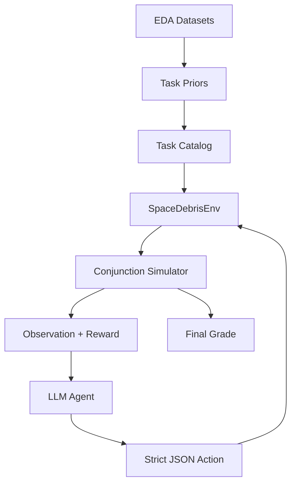

**Main flow:** Data calibrates task design, the agent interacts with the environment, and the simulator returns rewards and final scores.

**Speaker notes:**  
Walk through the diagram from data to environment to agent loop. The LLM does not directly edit simulator state; it only emits actions.

---

# Slide 6: Environment Loop

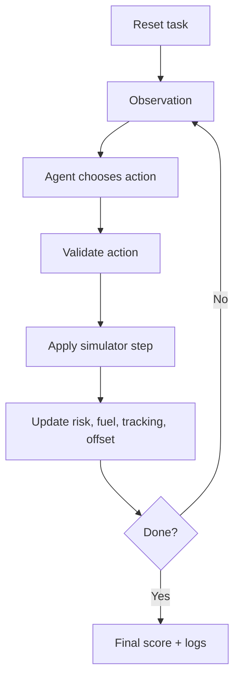

The environment behaves like a compact RL-style benchmark:

- observation in,
- action out,
- reward and next state returned,
- episode ends when horizon, success, collision, fuel, or offset limits are reached.

**Speaker notes:**  
Use this slide to explain how the agent experiences the project. It only sees observations and feedback; it must learn useful behavior through the loop.

---

# Slide 7: Observation And Action Design

The observation includes:

- remaining horizon,
- fuel remaining,
- tracking quality and tracking budget,
- mission offsets,
- total and highest collision probability,
- visible conjunction events,
- previous action and action error.

Each visible event includes:

- collision probability,
- predicted miss distance,
- time to closest approach,
- uncertainty,
- radial, along-track, and normal maneuver effectiveness.

**Speaker notes:**  
This slide explains why the LLM has enough structure to reason. The observation includes both resource state and threat geometry.

---

# Slide 8: Action Tradeoffs

| Action | Why use it? | What can go wrong? |
|---|---|---|
| `noop` | Conserves resources | Risk can grow |
| `request_tracking_update` | Reduces uncertainty | Can exhaust tracking budget |
| `radial_maneuver` | Helps radial-dominant threats | Uses fuel and adds offset |
| `along_track_maneuver` | Helps along-track threats | May not help other geometry |
| `normal_maneuver` | Helps out-of-plane threats | Uses fuel and mission margin |

**Core tradeoff:** More safety usually costs fuel, tracking budget, or mission geometry.

**Speaker notes:**  
Point out that no action is universally correct. The agent has to match the current threat state and still preserve resources for later steps.

---

# Slide 9: Difficulty Scaling

| Parameter | Easy | Medium | Hard |
|---|---:|---:|---:|
| Horizon | 6 | 8 | 10 |
| Initial fuel | 9.5 | 8.0 | 7.2 |
| Tracking budget | 2 | 2 | 3 |
| Conjunction count | 1 | 2 | 3 |
| Max offset | 2.4 km | 2.1 km | 1.9 km |

Difficulty increases by adding more threats, lowering certainty, tightening resources, and requiring better maneuver-axis selection.

**Speaker notes:**  
Use this as evidence that the benchmark is controlled. The hard task is harder because it introduces competing threats and tighter operating limits.

---

# Slide 10: Simulator Mechanics

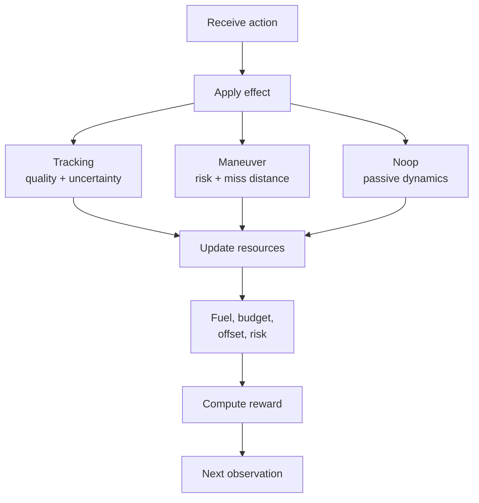

The simulator is a structured physics proxy, not a high-fidelity orbital propagator.

It preserves the key operational tradeoffs while staying deterministic, lightweight, and easy to evaluate.

**Speaker notes:**  
Clarify that the project models decision dynamics, not full orbital mechanics. That is appropriate for a benchmark where reproducibility and controllability matter.

---

# Slide 11: Scoring And Success

The project uses both dense rewards and final scoring.

**Step reward rewards:**

- risk reduction,
- useful tracking updates,
- episode survival.

**Step reward penalizes:**

- fuel use,
- mission-offset growth,
- wasted actions.

**Final score combines:** safety, fuel efficiency, mission preservation, tracking efficiency, and completion status.

**Speaker notes:**  
Explain the key distinction: score and reward can improve even when binary success remains false, because success has strict terminal thresholds.

---

# Slide 12: Data Inputs For Priors

The project connects EDA to the simulator through an offline prior-generation step.

Datasets used:

- **SATCAT:** object classification and debris ratio.
- **UCS Satellite Database:** orbit regime distribution.
- **Kelvins labels:** uncertainty and risk-scaling features.

Generated priors affect:

- initial tracking quality,
- success probability threshold,
- conjunction uncertainty,
- risk growth rate,
- tracking sensitivity.

**Speaker notes:**  
This slide shows that the EDA has a functional role. It is not only report material; it calibrates environment parameters.

---

# Slide 13: EDA Prior - Debris Ratio

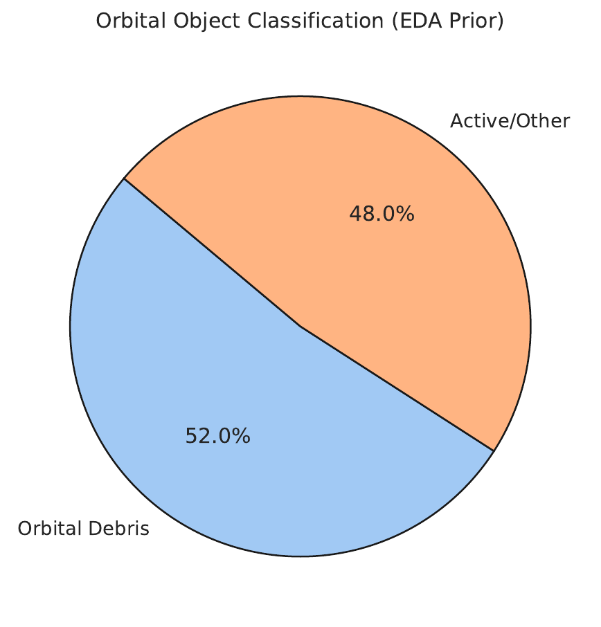

**Interpretation:**

- Debris ratio is about `0.52`.
- Many threats are non-cooperative objects.
- The active satellite must carry the burden of avoidance.

**Speaker notes:**  
Use this chart to motivate why autonomous collision avoidance matters. Debris cannot maneuver or coordinate with the active spacecraft.

---

# Slide 14: EDA Prior - Orbit Regime

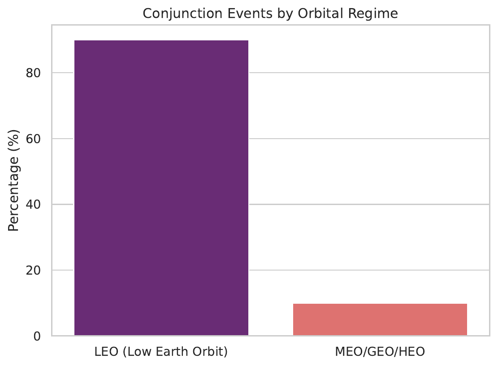

**Interpretation:**

- LEO ratio is about `0.90`.
- LEO is treated as a dense conjunction environment.
- This justifies mission-offset penalties because careless maneuvers can create new operational problems.

**Speaker notes:**  
Connect dense LEO operations to the offset constraint. A maneuver is not free even if it reduces current collision probability.

---

# Slide 15: EDA Prior - Risk And Uncertainty

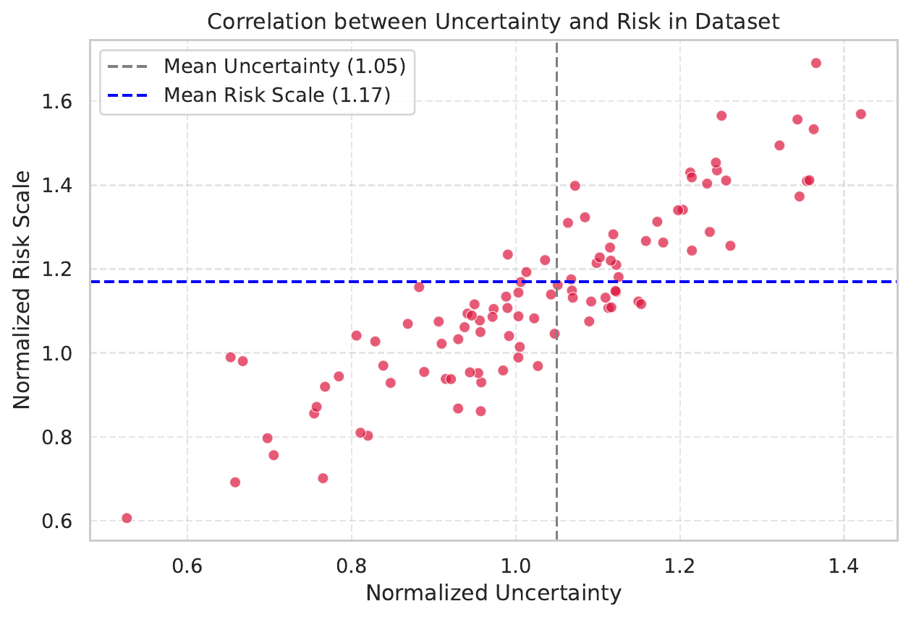

**Interpretation:**

- Risk scale is about `1.17`.
- Uncertainty scale is about `1.05`.
- Early tracking updates are useful when uncertainty is high.

**Important caveat:** Tracking updates stop being useful when uncertainty is already reduced or the tracking budget is exhausted.

**Speaker notes:**  
This slide sets up the later result. The LLM correctly learns that tracking matters, but it struggles with the stop condition.

---

# Slide 16: Data-To-Priors Pipeline

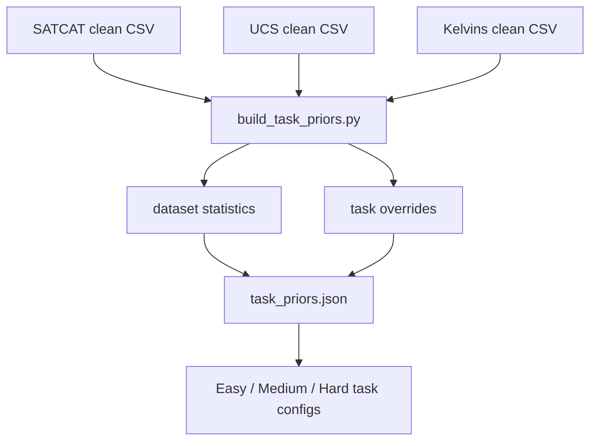

Key generated values:

- `debris_ratio`: 0.5214
- `leo_ratio`: 0.8952
- `risk_scale`: 1.1721
- `tracking_scale`: 1.2

**Speaker notes:**  
Explain this as an offline bridge between analysis and runtime. The simulator stays simple while still being informed by data.

---

# Slide 17: LLM Agent Method

The LLM receives:

- current observation,
- strategy notes,
- recent action history,
- previous rewards,
- optional cross-round memory.

It must return strict JSON:

```json
{"action_type": "radial_maneuver", "magnitude": 0.52}
```

The inference layer parses and validates this into an environment action.

**Speaker notes:**  
Stress that the LLM is used as a structured decision policy. It is not giving advice in prose; it controls the environment through valid JSON actions.

---

# Slide 18: Iterative Inference

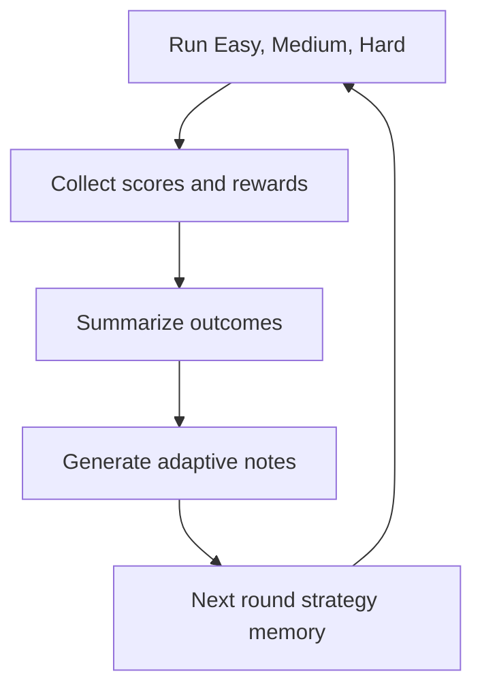

This is **not** gradient-based reinforcement learning.

It is reward-informed iterative prompting:

- run tasks,
- summarize what happened,
- feed lessons into the next round,
- select the best round by evaluation metrics.

**Speaker notes:**  
Be careful with terminology. The project uses RL-style environment interaction, but the LLM weights are not trained.

---

# Slide 19: Result - Average Score

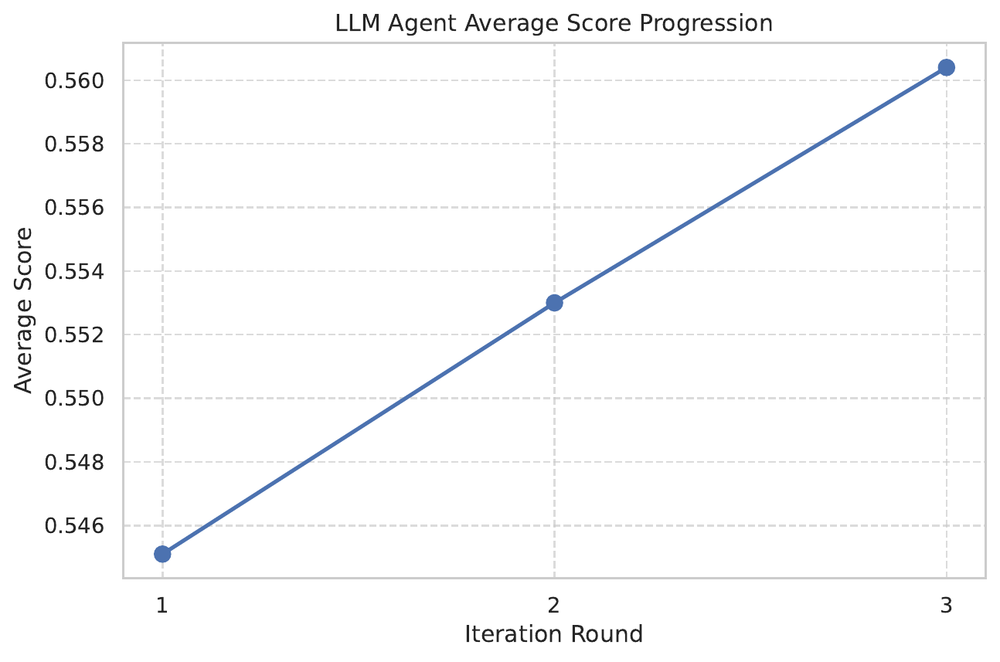

Average score improved across the representative 3-round run:

- Round 1: `0.5451`
- Round 2: `0.5530`
- Round 3: `0.5604`

**Interpretation:** Cross-round memory produced measurable but modest improvement.

**Speaker notes:**  
Lead with the improvement, then qualify it. This trend is real in the saved run, but it does not mean the agent solved the full task.

---

# Slide 20: Result - Average Reward

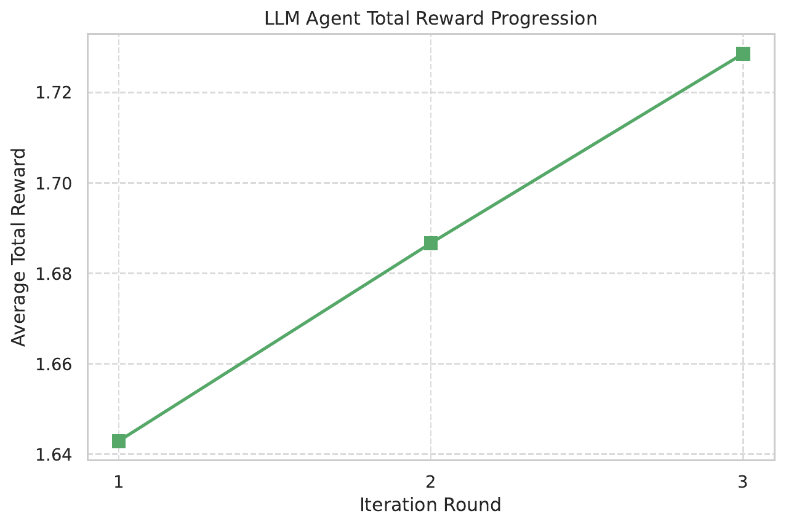

Average total reward also improved:

- Round 1: `1.6429`
- Round 2: `1.6867`
- Round 3: `1.7286`

**Interpretation:** The agent got better at collecting dense step rewards, especially from tracking updates and some risk-reducing actions.

**Speaker notes:**  
Use this slide to explain that dense reward gives more detailed feedback than success rate alone.

---

# Slide 21: Result - Task Difficulty

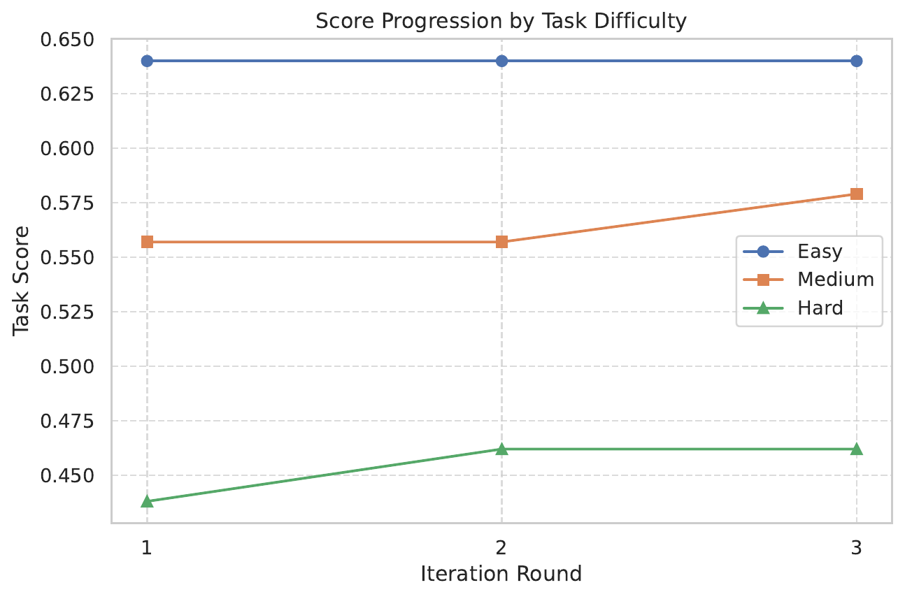

Observed pattern:

- Easy task performed best because it has one threat.
- Medium improved in the final round.
- Hard remained difficult due to competing multi-threat geometry.

**Speaker notes:**  
Explain that the hard task exposes the limits of LLM numeric and spatial reasoning. It must reason across multiple threats and maneuver axes.

---

# Slide 22: Result - Action Distribution

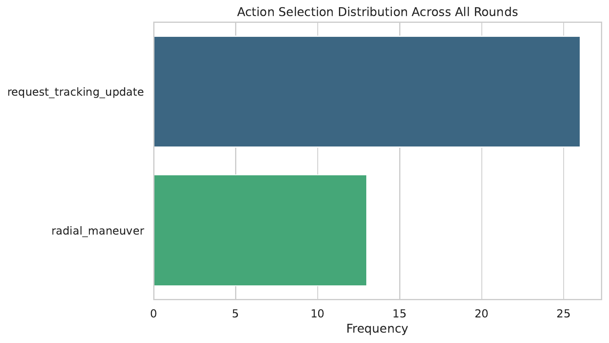

The agent strongly preferred `request_tracking_update`.

This helped early in episodes, but it also caused repeated tracking requests after the budget was exhausted.

**Speaker notes:**  
This is the key behavioral insight. The LLM followed the data prior too aggressively and needed stronger resource-budget discipline.

---

# Slide 23: Failure Analysis

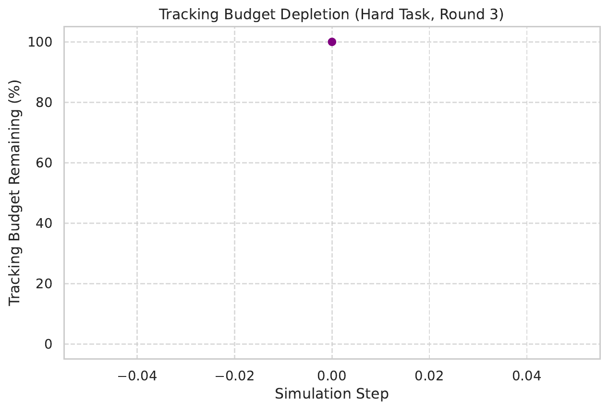

Why strict success stayed low:

- the agent over-requested tracking updates,
- exhausted tracking budget caused wasted turns,
- maneuvers were sometimes delayed,
- radial maneuvers were overused,
- residual collision probability often stayed above the success threshold.

**Speaker notes:**  
This is the honest interpretation slide. The system improved reward and score, but strict success remained hard because the policy had planning weaknesses.

---

# Slide 24: Final Takeaways

The project demonstrates:

- how to model collision avoidance as sequential decision-making,
- how to connect EDA outputs to environment priors,
- how to use an LLM as a structured action-selection agent,
- how to evaluate improvement across iterative rounds,
- why hybrid planning is needed for exact maneuver control.

**Best future direction:** Use the LLM for high-level strategy and a deterministic optimizer for exact maneuver axis and magnitude.

**Speaker notes:**  
End with a balanced message. The project is a strong benchmark and agent-evaluation system, and the next step is a hybrid autonomy stack rather than relying on the LLM alone.
